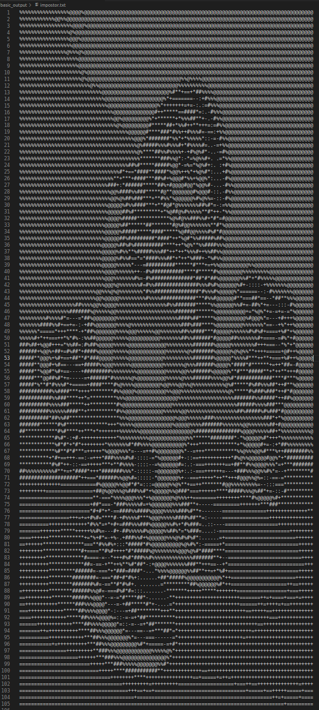
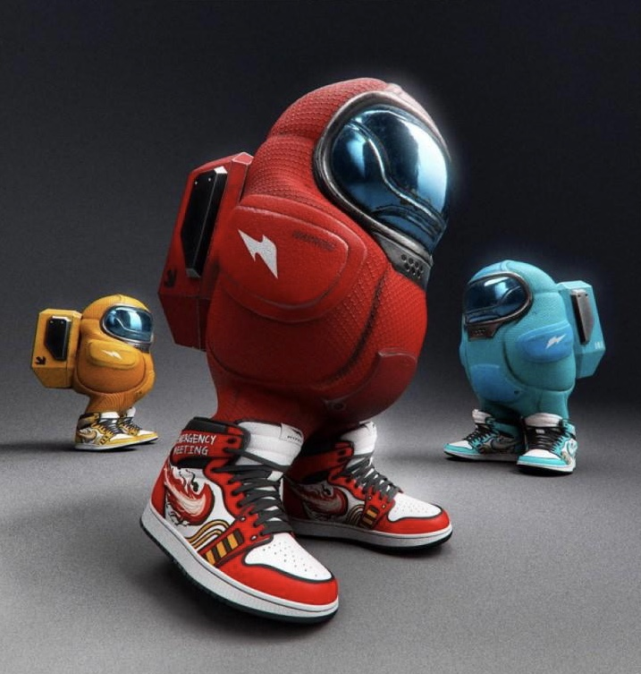

# ascii-artist

## Convert images to ascii art

### How to Run Basic Model

* Add your own png or jpg files to images/
* Run `python3 basic_model.py "brain.jpg"` (modify filepath: brain.jpg)
* View output txt files written to `basic_output/`

### Arguments

* First arg: filepath within `images/`
* 2nd arg (optional): width of output text/image
* 3rd arg (optional): ratio multiplier of height to width
  * `python3 basic_model.py "brain.jpg" 200 2`
  * Set output width to 200 and multiply height/width ratio by 2

### Requirements
  
* Numpy
* Pillow

