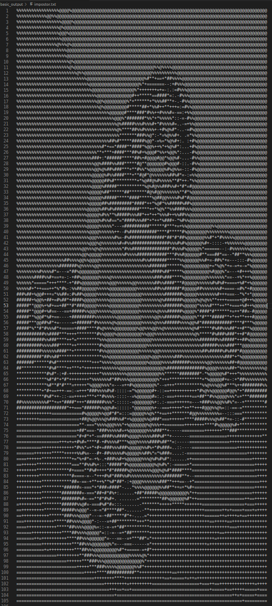
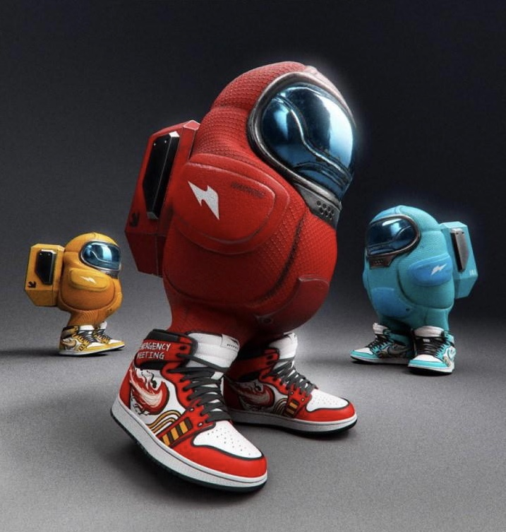

# ascii-artist

## 1. Convert images to ascii art

### How to Run Image Model

* Add your own png or jpg files to images/
* Run `python3 basic_model.py "brain.jpg"` (modify filepath: brain.jpg)
* View output txt files written to `image_output/`

### Arguments

* The first argument is the filepath within `images/` of the image you want to convert.
* The second argument (optional) sets the width of the output text/image to 200.
* The third argument (optional) multiplies the height/width ratio by 2.
  * `python3 basic_model.py "brain.jpg" 200 2`
  * Set output width to 200 and multiply height/width ratio by 2

### Requirements
  
* Numpy
* Pillow

 

## 2. Convert text to ascii text art

* Fonts are stored in json format in the `/fonts/` dir.
* Select a font.json file in the `text_to_text.py` script.
* Run the script with or without a parameter. The program will ask you for text input.
  * `python .\text_to_text.py TYPESOMETHINGHERE`
  * `python .\text_to_text.py`
* Output is written to a txt file in `/text_output/`
  * Filename is determined by first few letters of input.

```plaintext
      ___      _______    ____       ____      .      __       _______          .      __        ____   
    //   ) )  //   / /   // | |    //    ) )  /|    //| |     //   / /         /|    //| |     //    ) )
   //___/ /  //____     //__| |   //    / /  //|   // | |    //____           //|   // | |    //    / / 
  / ___ (   / ____     / ___  |  //    / /  // |  //  | |   / ____           // |  //  | |   //    / /  
 //   | |  //         //    | | //    / /  //  | //   | |  //         ___   //  | //   | |  //    / /   
//    | | //____/ /  //     | |//____/ /  //   |//    | | //____/ /  /__/  //   |//    | | //____/ /    
```

```plaintext
  _|_|_|      _|_|_|_|      _|_|      _|_|_|      _|      _|    _|_|_|_|      _|      _|    _|_|_|    
  _|    _|    _|          _|    _|    _|    _|    _|_|  _|_|    _|            _|_|  _|_|    _|    _|  
  _|_|_|      _|_|_|      _|_|_|_|    _|    _|    _|  _|  _|    _|_|_|        _|  _|  _|    _|    _|  
  _|    _|    _|          _|    _|    _|    _|    _|      _|    _|            _|      _|    _|    _|  
  _|    _|    _|_|_|_|    _|    _|    _|_|_|      _|      _|    _|_|_|_|  _|  _|      _|    _|_|_|    
```

```plaintext
  ________    ___    _      __       ________  ________       ___        _    __  ________
 /__  ___/  //   ) ) \\    / /      /_______/ /__  ___/     //   ) )    //   / / /__  ___/
   / /     //___/ /   \\  / /         / /       / /        //   / /    //   / /    / /    
  / /     / ___ (      \\/ /         / /       / /        //   / /    //   / /    / /     
 / /     //   | |       / /       __/ /___    / /        //   / /    //   / /    / /      
/ /     //    | |      / /       /_______/   / /        ((___/ /     ((__/ /    / /       
```
